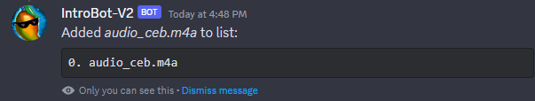
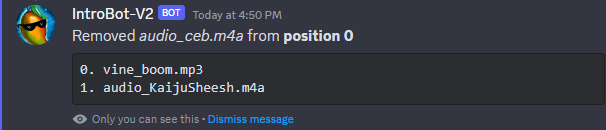
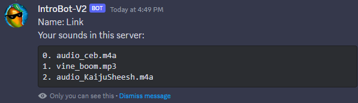

# Discord-Introbot

## Set up a Discord bot in the Developer portal
- Set up a new Discord Application (https://discord.com/developers/applications)
- Invite the bot to your Discord server
- Get the bot's token and clientId
- (Optional) Select a default server's guildId to test slash commands
- Place the above info into `config.json`

## Dependecies
- nodejs

    Then install all node packages
- `npm i`

## Running the bot
- (First time run only, then rerun whenever new slash commands are added/modified) 

    `node ./global-deploy-commands.js`
- `./run.sh`
    or
- `node index.js`

## Discord server slash '/' commands
- /register (name)
    - Must be run first! Registers the user to the current server with {name} in `db.json`
    - Allows for easier manual parsing of `db.json` since user IDs are long integers
- /add-audio (link-to-file)
    - Example (link-to-file)
    `https://cdn.discordapp.com/attachments/xxxxxxxxxxxxxx/xxxxxxxxxxxxxxxxxx/vine_boom.mp3`
    - Files can be uploaded to Discord anywhere, then right click the blue link and select "Copy Link", this will give you the `(link-to-file)`
    - This command appends that link to a user's sound array
    - Each user can have a unique sound library per server, each kept independent of one another
        
        
- /remove-audio (list-position)
    - Audio files associated to a user are in an array, starting at position 0
    - This command removes the audio file in integer position `(list-position)`
    - If you have 4 sounds and want to remove the third one, input 2 for `(list-position)`

        
- /change-name (new-name)
    - Input a new name for user in current server
        
        
- /info
    - This prints out the user's current sound library and lists their position

        

## Updating slash '/' commands to all servers
- `node ./global-deploy-commands.js`
  
## Updating slash '/' commands to only the default server
This applies to the `guildId` server in `config.js`